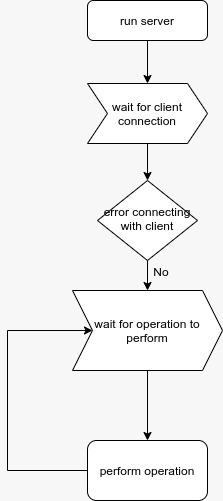
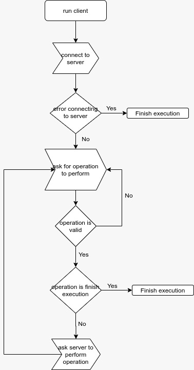
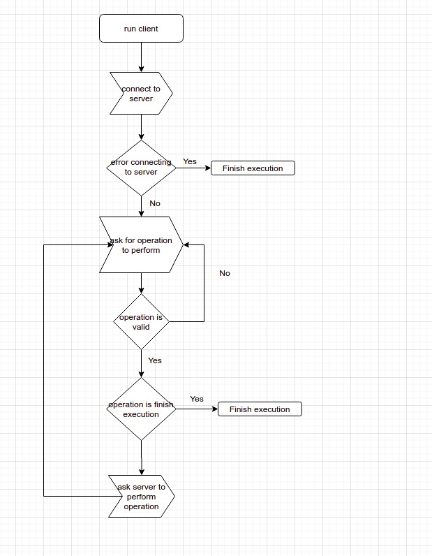
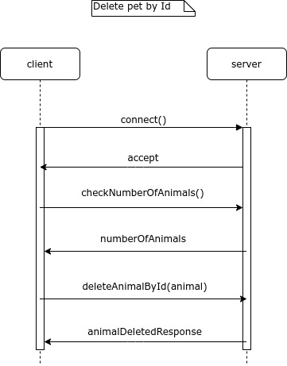
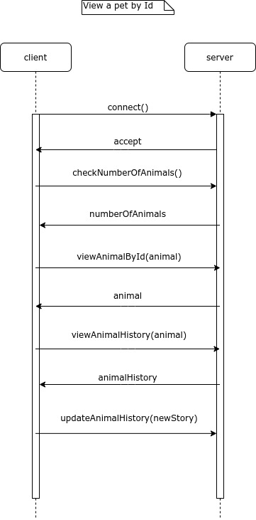
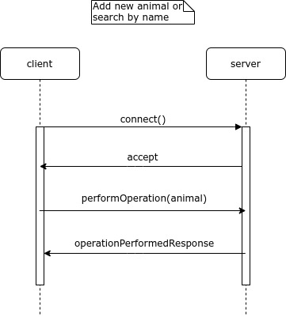
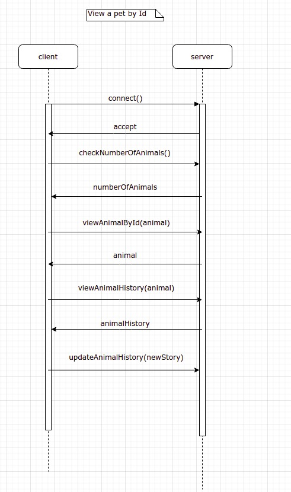

Existen varias partes en las que se ha segmentado el programa para su desarrollo. Cada una de estas partes tiene estructuras y funciones que permiten que el programa se desempeñe adecuadamente. Vamos a recorrer estas funciones y estructuras de acuerdo a los headers que se crearon. 

MASCOTAS
======
Contiene la estructura `mascota` que tiene todos los datos importantes de una mascota. Dentro de las funciones que hay existen:
`int hashear_nombre(char *str);`
Nos permite obtener el hash de un arreglo de characteres
`std::string leerHistoriaClinica(char* ruta);`
Nos permite leer la historia clinica a partir de una ruta
`void escribirHistoriaClinica(char* ruta, std::string data);`
Nos permite escribir una historia clinica. Se usa para actualizarla cuando el cliente la actualiza y la envia

MENSAJE
=======
Para facilitar la comunicación entre servidor y cliente se usan dos estructuras claves, `Mensaje` y `RespuestaServidor`. Mediante la primera se envia toda la información necesaria al server desde el cliente para hacer una petición, incluyendo el tipo de petición que se realiza. Con las segunda tenemos una forma dentro del cliente de tener la respuesta a todas las peticiones y depues poder transformarlo en un mensaje de characteres que se le pasa al cliente. 

____

Como se puede pensar el server y el cliente tienen que tener diferentes operaciones. Mientras el Server no puede hacer un menu el cliente no debería editar archivos binarios, de hecho el único archivo que debería editar es el de la historia clínica y aún así eso lo edita un editor de texto ajeno al programa. Es por esta razón que el servidor tiene algunos headers que el cliente no.

LIBRERIAS PROPIAS DEL SERVER
==============================

PARA LA EDICIÓN DE ARCHIVOS
----------
`int recuperar_id (int num_id);`
Busca el indice en donde se encuentra almacenado en la base datos la mascota con id `num_id`

`void escribir_al_final_id (int num_idx);`
Permite añadir un nuevo id de mascota que se encuentra en el indice `num_idx`

`void escribir_id_a_indice(int id, int new_idx);`
Nos permite cambiar el indice en el que se encontraba una mascota con id `id`

`int recuperar_hash(int h);`
nos permite ver el indice de la ultima mascota con hash `h`

`void escribir_hash(int h, int new_index);`
Nos permite cambiar el indice al que apunta el hash `h`

`Mascota recuperar_indice(int num_item);`
Podemor consultar una mascota 

`void imprimir_estructura(Mascota *m);`
una funcion para poder imprimir una mascota, deprecada, usar to_string()

`void escribir_al_final (Mascota *m);`
añade una nueva mascota

`void escribir_mascota_a_indice(int idx, Mascota *m);`
escribe una mascota en un indice particular. Util cuando se eliminan mascotas pero no se hace rezise del binario

`void borrar_indice(int idx);`
nos permite eliminar un indice de mascota

`void anadir_mascota(Mascota *m);`
Nos permite añadir una mascota

PARA EL ENTENDIMIENTO DE LAS PETICIONES DEL CLIENTE
----------
1. `RespuestaServidor recibirMensajeCliente(Mensaje mensaje);`
   
   Recibe el mensaje del cliente y lo envia a los iterales 2-5 de acuerdo al tipo de mensaje.

2. `RespuestaServidor eliminarMascota(Mascota mascota);`

3. `RespuestaServidor anadirMascota(Mascota mascota);`

4. `RespuestaServidor verMascota(Mascota mascota);`

5. `RespuestaServidor buscarMascota(Mascota mascota);`

6. `std::string respuestaToString(RespuestaServidor respuesta, Mensaje mensaje);`

   Genera una respuesta a modo de string para el cliente a partir de la realización de la petición 

7. `std::string obtenerHistoriaClinica(Mascota mascota);`

    Saca la historia clinica de una mascota

8. `void cambiarHistoriaClinica(Mascota mascota, std::string nuevaHistoriaClinica);`

    cambia la historia clinica de acuerdo a los cambios realizados por el cliente.

MAIN SERVIDOR
----------
Para el main del cliente el cliente escucha las peticiones de los clientes.

LIBRERIAS DEL CLIENTE
--------------
Para el caso del cliente solo hay una cosa que necesita hacer a menudo, generar el menu y enviar la información y enviarla al servidor. Para enviarla lo genera a tráves de `main_cliente.cpp`

INTERACCIÓN CON MENU
---------------
1. `Mensaje menu(std::string respuestaTamano);`
envia un menu, se le pasa como argumento la cantidad de elementos en el server como string para que pueda mostrarlo en el orden correcto. Luego pasa a submenus de acuerdo a la opción que escoge el cliente de 2-5

1. `Mensaje anadir_reg();`

1. `Mensaje ver_reg();`

1. `Mensaje borrar_reg();`

1. `Mensaje buscar_reg();`

1. `bool userYesNoInputIsValid(std::string input);`
Verifica un input de si y no del usuario

1. `void makePause(std::string message);`
genera una pausa de input que se detiene al presionar una tecla cualquiera

1. `std::string editarHistoriaClinica(std::string historiaClinicaOriginal, int id);`
 permite editar la historia clinica con el editor del usuario

Imagenes del proceso
=====================

